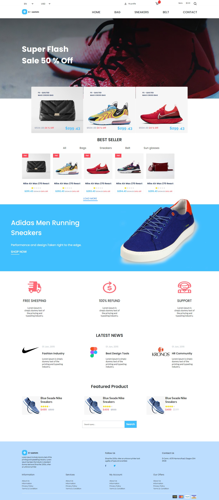

# E-comm App with Reactjs
this is my third project at Grazac Academy
## Table of contents

- [E-comm-web-app Travel landing page](#E-comm-web-app full pages)
  - [Links](#links)
  - [Getting Started](#getting-started)
  - [Built with](#built-with)
  - [What I learned](#what-i-learned)
  - [Continued development](#continued-development)
  - [Useful resources](#useful-resources)
  - [Author](#author)
- [Acknowledgments](#acknowledgments)

# E-comm web application

Users should be able to:

- User should be able to see all the available products and add them to the cart and as well make a purchase.

### Getting Started

### Links
- [GitHub] (https://github.com/Eyiowuawi/E-comm-react-app.git)

- [Vercel] (https://e-comm-react-app.vercel.app/)

## Built with

- Reactjs with the use of React Hooks, Reducer, Context api and so om
- CSS custom properties
- Flexbox and grid

### What I learned
I learnt to really use the context api and the use of hooks.
I learnt to use the useState and useEffect hooks.

### Challenges
 I encountered a lot of problems with the use of the context api and the use of the useState and useEffect hooks but I managed to solve them.

### Continued development

I want to focus more on reactjs, media query, and css animations.

### Useful resourses

- [Google Fonts](https://www.fonts.google.com) - This help me with the various fonts used in my project.
- [youtube tutorials](https://www.youtube.com ) -the tutorials on YouTube by Kelvin Powell and many others were a great resource for me.
- [w3schools](http://w3schools.com) - this was a major resource to get used to css, JavaScript and html
- [Stack overflow](http://stackoverflow.com) - this was a go back place to resolve some of the bugs I had using git and GitHub.

## Author

- Twitter - [@tolu_wa_laseh](https://www.twitter.com/tolu_wa_laseh)
- Github - [@eyiowuawi](https://www.github.com/eyiowuawi)
- LinkedIn- [@adeosuntat] (www.linkedin.com/in/adeosuntat)

## Acknowledgments
 I thank Mr Mayowa and Kevin Powell, Brian and traversy media who are my YouTube teacher. Thanks to Grazac for the experience of the challenge.
